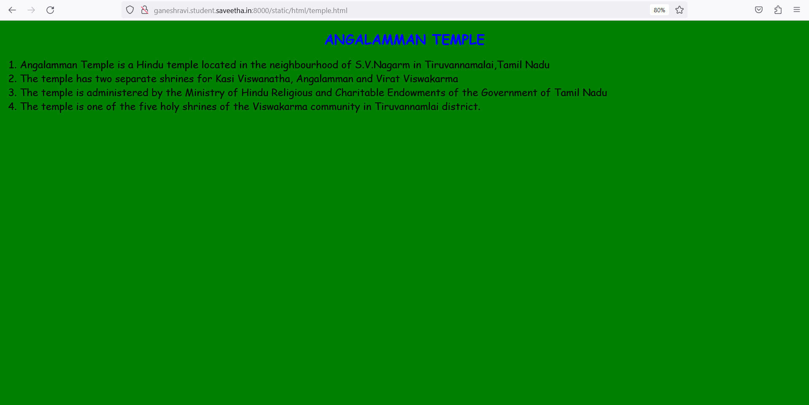
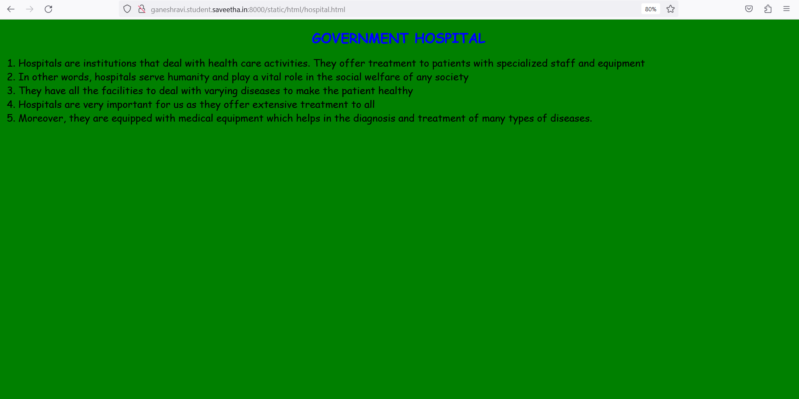
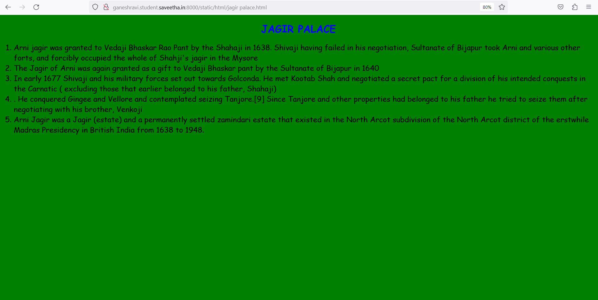
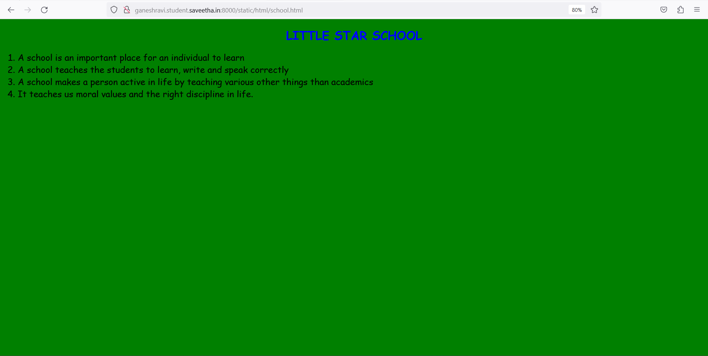

# Places Around Me
## AIM:
To develop a website to display details about the places around my house.

## Design Steps:

### Step 1:
Clone the git repository into Theia IDE
### Step 2:
Create a new Django project.
## Code:
### Name : GANESH R
### REGISTER NUMBER : 212222240029
```html
map.html :

<!DOCTYPE html>
<html>
    <head>
        <title>image mapping</title>
    </head>
    <body bgcolor="yellow">
        <h1 align="center"><font color="blue"><b>MY PLACES</b></font></h1>
        <h3 align="center">GANESH R(212222240029)</h3>
        <center>
            
            <map name="image-maps-2023-05-17-035237" id="ImageMapsCom-image-maps-2023-05-17-035237">
                <area  alt="" title="TEMPLE" href="http://ganeshravi.student.saveetha.in:8000/static/html/temple.html" shape="rect" coords="323,101,450,175" style="outline:none;" target="_self"     />
                <area  alt="" title="HOSPITAL" href="http://ganeshravi.student.saveetha.in:8000/static/html/hospital.html" shape="rect" coords="221,179,399,259" style="outline:none;" target="_self"     />
                <area  alt="" title="CRICKET GROUND" href="http://ganeshravi.student.saveetha.in:8000/static/html/cricketground.html" shape="rect" coords="333,501,493,588" style="outline:none;" target="_self"     />
                <area  alt="" title="JAGIR PALACE" href="http://ganeshravi.student.saveetha.in:8000/static/html/jagir palace.html" shape="rect" coords="711,624,925,731" style="outline:none;" target="_self"     />
                <area  alt="" title="SCHOOL" href="http://ganeshravi.student.saveetha.in:8000/static/html/school.html" shape="rect" coords="831,267,1045,374" style="outline:none;" target="_self"     />
                <area shape="rect" coords="1318,735,1320,737" alt="Image Map" style="outline:none;" title="Image Map" href="https://www.image-maps.com/" />
        </map>
        </center>
    </body>
</html>


school.html:
<!DOCTYPE html>
<html>
<head>
    <title>
        SCHOOL
    </title>
</head>
<body bgcolor="green">
<h1 align="center">
    <font color="blue" face="cursive">
        LITTLE STAR SCHOOL
    </font>
</h1>
<p align="center">
    <font color="black" face="Comic Sans MS" size="5" >
        <OL  TYPE="1" START="1">
            <LI>A school is an important place for an individual to learn</LI>
            <LI>A school teaches the students to learn, write and speak correctly</LI>
            <LI>A school makes a person active in life by teaching various other things than academics</LI>
            <LI>It teaches us moral values and the right discipline in life.</LI>
        </OL>
    </font>
</p>
</body>
</html>

jagirpalace.html:
<!DOCTYPE html>
<html>
<head>
    <title>
        PALACE
    </title>
</head>
<body bgcolor="green">
<h1 align="center">
    <font color="blue" face="cursive">
        JAGIR PALACE
    </font>
</h1>
<p align="center">
    <font color="black" face="Comic Sans MS" size="5" >
        <OL  TYPE="1" START="1">
            <LI>Arni jagir was granted to Vedaji Bhaskar Rao Pant by the Shahaji in 1638. Shivaji having failed in his negotiation, Sultanate of Bijapur took Arni and various other forts, and forcibly occupied the whole of Shahji's jagir in the Mysore</LI>
            <LI>The Jagir of Arni was again granted as a gift to Vedaji Bhaskar pant by the Sultanate of Bijapur in 1640</LI>
            <LI>In early 1677 Shivaji and his military forces set out towards Golconda. He met Kootab Shah and negotiated a secret pact for a division of his intended conquests in the Carnatic ( excluding those that earlier belonged to his father, Shahaji)</LI>
            <LI>. He conquered Gingee and Vellore and contemplated seizing Tanjore.[9] Since Tanjore and other properties had belonged to his father he tried to seize them after negotiating with his brother, Venkoji</LI>
            <LI>Arni Jagir was a Jagir (estate) and a permanently settled zamindari estate that existed in the North Arcot subdivision of the North Arcot district of the erstwhile Madras Presidency in British India from 1638 to 1948.</LI>
        </OL>
    </font>
</p>
</body>
</html>

temple.html:
<!DOCTYPE html>
<html>
<head>
    <title>
        TEMPLE
    </title>
</head>
<body bgcolor="green">
<h1 align="center">
    <font color="blue" face="cursive">
        ANGALAMMAN TEMPLE
    </font>
</h1>
<p align="center">
    <font color="black" face="Comic Sans MS" size="5" >
        <OL  TYPE="1" START="1">
            <LI>Angalamman Temple is a Hindu temple located in the neighbourhood of S.V.Nagarm in Tiruvannamalai,Tamil Nadu</LI>
            <LI> The temple has two separate shrines for Kasi Viswanatha, Angalamman and Virat Viswakarma</LI>
            <LI>The temple is administered by the Ministry of Hindu Religious and Charitable Endowments of the Government of Tamil Nadu</LI>
            <LI>The temple is one of the five holy shrines of the Viswakarma community in Tiruvannamlai district.</LI>
        </OL>
    </font>
</p>
</body>
</html>

cricketground.html:
<!DOCTYPE html>
<html>
<head>
    <title>
        CRICKET GROUND
    </title>
</head>
<body bgcolor="green">
<h1 align="center">
    <font color="blue" face="cursive">
        007 CRICKET GROUND
    </font>
</h1>
<p align="center">
    <font color="black" face="Comic Sans MS" size="5" >
        <OL  TYPE="1" START="1">
            <LI>Cricket is a bat-and-ball game played between two teams of eleven players on a field at the centre of which is a 22-yard (20-metre) pitch with a wicket at each end, each comprising two bails balanced on three stumps.</LI>
            <LI>Cricket is one of the most popular games not just in India but across the world</LI>
            <LI>It is played between two teams consisting of a total of eleven players each</LI>
            <LI>The game of cricket is said to be originated in the 16th century in South East England. It instantly became popular among the people of England</LI>
            <LI> England named it as its national sport in the 18th century.</LI>
        </OL>
    </font>
</p>
</body>
</html>

hospital.html:
<!DOCTYPE html>
<html>
<head>
    <title>
        HOSPITAL
    </title>
</head>
<body bgcolor="green">
<h1 align="center">
    <font color="blue" face="cursive">
        GOVERNMENT HOSPITAL
    </font>
</h1>
<p align="center">
    <font color="black" face="Comic Sans MS" size="5" >
        <OL  TYPE="1" START="1">
            <LI>Hospitals are institutions that deal with health care activities. They offer treatment to patients with specialized staff and equipment</LI>
            <LI>In other words, hospitals serve humanity and play a vital role in the social welfare of any society</LI>
            <LI>They have all the facilities to deal with varying diseases to make the patient healthy</LI>
            <LI>Hospitals are very important for us as they offer extensive treatment to all</LI>
            <LI>Moreover, they are equipped with medical equipment which helps in the diagnosis and treatment of many types of diseases.</LI>
        </OL>
    </font>
</p>
</body>
</html>
```
## CLIENT OUTPUT:






## Server Output:

## Web Validator:

## Result:
Thus The Web Is Developed To Show The Details of My Place